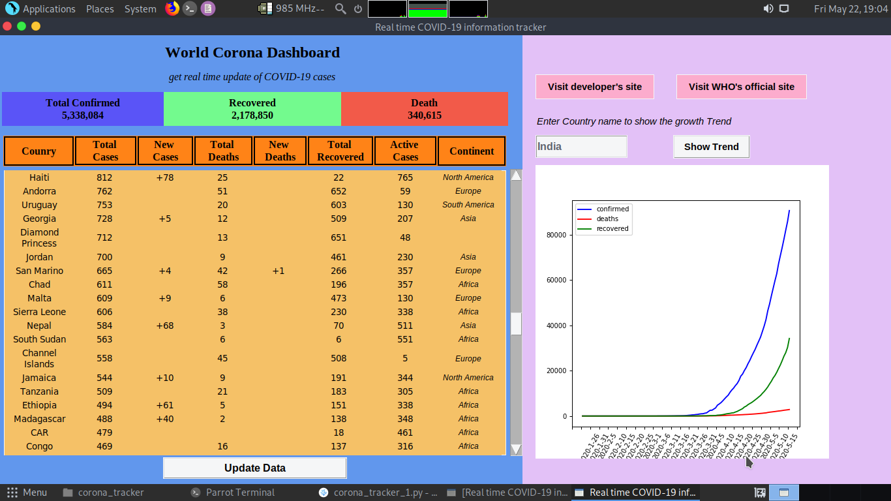

# Corona-Tracker
## Real time COVID-19 information tracker
### Features:
  * It will give every *detailed daily informations* of COVID-19 cases *by Country*
  * User will be able to show the *graphical trend* of *Active cases, Recovery* and *Death* of COVID-19 Cases *by Country*

### Modules used:
 1. tkinter 
 2. BeautifulSoup4
 3. matplotlib
 4. json
 5. requests
 6. pandas 
 7. numpy 
 8. textwrap
 9. selenium

### To use this program:
 * run *pip install -r requirements.txt*
 * Choose your webdriver as your browser preference in this case *chromedriver*
 * change the *chromedriver path* to where your chromedriver is located.
 * Run the python file *corona_tracker_1.py*.
 * This *programn GUI is compatible on linux*. You can run on windows also but have to fix some UI bugs.
 
### Programe Interface:

